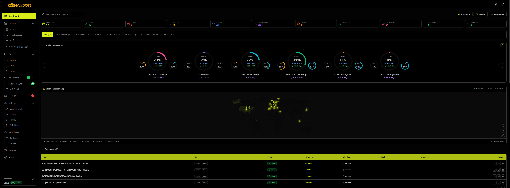

<div align="center">
  
  
  # Komandorr
  
  **A modern, feature-rich monitoring dashboard for your services and infrastructure**
  
  Monitor websites, APIs, apps, and services with real-time status tracking, response time graphs, and traffic analytics.

<div align="center">


</div>
  
  
  
  [](https://github.com/cyb3rgh05t/komandorr/releases)
  [](LICENSE)
  [](https://github.com/cyb3rgh05t/komandorr/stargazers)
  [](https://cyb3rgh05t.github.io/komandorr/)
  
</div>

## ✨ Features

### 🎯 Core Monitoring

- **Real-time Status Tracking**: Monitor websites, APIs, apps, and custom services
- **Response Time Graphs**: Visual charts showing service performance over time
- **Traffic Analytics**: Circular progress bandwidth monitoring with carousel navigation, real-time speeds, and cumulative data transfer
- **Smart Health Checks**: Automatic detection of online/offline/problem states
- **Grouped Services**: Organize services by category (Production, Development, Media, etc.)

### 🎭 Plex Invite Management (v2.4.1)

- **Custom Invite Codes**: Generate secure invite links with usage limits and expiration dates
- **Multi-Badge Status System**: Visual indicators showing Active, Redeemed, Expired, Used Up, and Disabled states simultaneously
- **Advanced Filtering**: Filter invites by All, Active, Redeemed, Expired, Used Up, or Disabled with real-time counts
- **Re-invitation Support**: Previously removed users can be re-invited without conflicts
- **Automatic Cleanup**: Orphaned invites are automatically deleted when the last user is removed
- **Library-Specific Access**: Grant access to specific Plex libraries (Movies, TV Shows, Music) or all
- **Permission Control**: Configure Sync, Live TV/Channels, and Plex Home access per invite
- **OAuth Redemption**: Wizarr-style OAuth flow for seamless Plex account integration
- **User Management**: View, edit, refresh, and remove Plex users from a dedicated management interface
- **User Expiration**: Set individual expiration dates for users independent from invite expiration
- **Automatic Provisioning**: Users are automatically added to your Plex server upon redemption
- **Real-time Statistics**: Track invite usage, active users, and redemption rates with separate redeemed counts

### 📊 Watch History & Analytics (v2.4.0)

- **Complete Watch Tracking**: Monitor all Plex viewing activity per user
- **Content Filtering**: Filter by content type (Movies, TV Episodes, Music)
- **Time Period Filtering**: View history for All Time, Today, This Week, or This Month
- **User Statistics**: Track total views, favorite content types, and last activity
- **Detailed History**: View progress, duration, view count, and ratings
- **Background Sync**: Automatic synchronization every 15 minutes
- **Search Functionality**: Search across usernames, emails, and content titles

### ⚡ Enterprise Caching System (v2.5.0)

- **In-Memory Caching**: 5-second TTL for Plex activities, 5-minute TTL for watch history and libraries
- **80%+ Cache Hit Rates**: Dramatically reduces Plex API calls and database queries
- **Background Statistics**: Pre-calculated dashboard stats updated every 60 seconds
- **Automatic Cache Warming**: Proactive refresh at 80% TTL threshold prevents cold caches
- **Sub-100ms Response Times**: Dashboard stats load 95% faster with background aggregation
- **Redis Support**: Optional distributed cache for multi-instance deployments
- **Performance Monitoring**: Real-time cache statistics with hit/miss rates and age tracking
- **Resource Reduction**: 83% fewer Plex API calls, 80% fewer database queries

### 💾 Database & Storage

- **SQLite Backend**: Efficient database storage with up to 1000 historical data points per service
- **Automatic Migration**: Seamless upgrade from JSON to SQLite
- **Data Persistence**: All service configurations and history stored reliably
- **Timezone Support**: Configurable timezone for logs and timestamps
- **Relational Schema**: Comprehensive invite, user, and watch history data with proper relationships

### 🎨 Customization

- **11 Beautiful Themes**: Dark, Plex, Jellyfin, Emby, Seerr, and 6 Infinity Stone themes
- **Multi-Language**: Full support for English and German (more coming soon)
- **Responsive Design**: Modern UI inspired by Sonarr/Radarr with sidebar navigation
- **Custom Intervals**: Set individual check intervals per service (30s - 1 hour)
- **Skeleton Loading**: Smooth loading states matching actual content layouts

### 🔐 Security

- **Optional Authentication**: Built-in username/password protection
- **Session Management**: Secure login with automatic session handling
- **Configurable Access**: Enable/disable auth dynamically via settings or .env
- **OAuth Security**: Secure Plex OAuth integration with PIN-based authentication

### 🛠️ Technology Stack

- **Backend**: Python 3.10+ with FastAPI and SQLAlchemy ORM
- **Frontend**: React 18 with Vite, TailwindCSS, and Lucide Icons
- **Database**: SQLite 3 for lightweight, serverless storage
- **API**: RESTful API with automatic OpenAPI/Swagger documentation (dark mode)
- **Caching**: TanStack Query for optimized data fetching and real-time updates

## 🚀 Quick Start

### Prerequisites

- **Python 3.10+** (with pip)
- **Node.js 18+** (with npm)
- **Git** (for cloning the repository)

### Installation

#### Option 1: Automatic Setup (Recommended for Windows)

```powershell
# Clone the repository
git clone https://github.com/cyb3rgh05t/komandorr.git
cd komandorr

# Run the setup script
.\setup.ps1
```

The setup script automatically:

- ✅ Creates Python virtual environment
- ✅ Installs backend dependencies
- ✅ Installs frontend dependencies
- ✅ Creates config.json configuration file
- ✅ Sets up logs directory

#### Option 2: Manual Setup (Cross-Platform)

### Starting the Application

**Option 1: With Start Scripts**

Terminal 1 - Backend:

```powershell
.\start-backend.ps1
```

Terminal 2 - Frontend:

```powershell
.\start-frontend.ps1
```

**Backend Setup:**

```bash
# Create and activate virtual environment
cd backend
python -m venv venv

# Windows
.\venv\Scripts\activate

# Linux/Mac
source venv/bin/activate

# Install dependencies
pip install -r requirements.txt

# Configuration will be created automatically on first run
# Edit backend/data/config.json for settings after first launch
```

**Frontend Setup:**

```bash
cd frontend
npm install
```

### Running the Application

**Terminal 1 - Backend:**

```bash
cd backend
python run.py
```

→ Backend API: `http://localhost:8000`  
→ API Docs: `http://localhost:8000/docs`

**Terminal 2 - Frontend:**

```bash
cd frontend
npm run dev
```

→ Dashboard: `http://localhost:3000`

**Or use the convenience scripts (Windows):**

```powershell
.\start-backend.ps1   # Terminal 1
.\start-frontend.ps1  # Terminal 2
```

## 📖 Usage Guide

### Adding Your First Service

1. **Start both backend and frontend** (see Running the Application above)
2. **Open the dashboard** at `http://localhost:3000`
3. **Click "Add Service"** button in the top navigation
4. **Fill in service details:**
   - Name: Display name for your service
   - URL: The endpoint to monitor (e.g., https://example.com)
   - Type: Service category (website, api, plex, etc.)
   - Group: Organizational category (Production, Development, etc.)
   - Interval: How often to check (30s - 1 hour)
   - Description: Optional notes about the service
5. **Click Save** - monitoring starts automatically!

### Managing Services

- **View Details**: Click any service card to see response time graphs and history
- **Edit Service**: Click the edit icon on a service card
- **Delete Service**: Click the delete icon (confirmation required)
- **Enable/Disable**: Toggle monitoring without deleting the service

### Customizing Your Dashboard

- **Change Theme**: Click the theme dropdown in top navigation (11 themes available)
- **Switch Language**: Click the language dropdown (EN/DE)
- **User Settings**: Click user icon for authentication and preferences
- **View Traffic**: Access the Traffic page for bandwidth monitoring (Plex services)

### Docker Deployment

See **[Docker Documentation](https://cyb3rgh05t.github.io/komandorr/getting-started/docker/)** for container deployment instructions.

## 💾 Database & Storage

### SQLite Database (v1.6.0+)

Komandorr uses SQLite for efficient, reliable data storage:

**Location:** `backend/data/komandorr.db`

**Schema:**

- `services` - Service configuration and current state
- `response_history` - Response time measurements (up to 1000 points per service)
- `traffic_history` - Bandwidth metrics (up to 1000 points per service)

**Benefits:**

- ✅ Fast queries with indexed lookups
- ✅ Stores 10x more history than JSON (1000 vs 100 points)
- ✅ Automatic data cleanup to prevent bloat
- ✅ Better concurrent access handling
- ✅ Single file, easy backups

### Migrating from JSON (v1.5.x)

If you're upgrading from an older version with `services.json`:

```bash
cd backend
python migrate_to_sqlite.py
```

✅ The script automatically:

- Reads all services from `services.json`
- Creates SQLite database with proper schema
- Imports all services with history preserved
- Backs up original JSON as `services.json.backup`
- No data loss - safe migration!

**Example service data:**

```json
[
  {
    "id": "550e8400-e29b-41d4-a716-446655440000",
    "name": "Service Name",
    "url": "https://example.com",
    "type": "website",
    "group": "Production",
    "interval": 60,
    "description": "Description",
    "enabled": true,
    "status": "online",
    "response_time": 125.5,
    "last_check": "2025-11-13T10:30:00.123456+00:00",
    "traffic": null,
    "traffic_history": [],
    "response_history": [
      {
        "timestamp": "2025-11-13T10:30:00.123456+00:00",
        "response_time": 125.5
      }
    ]
  }
]
```

## ⚙️ Configuration

### Configuration System

Komandorr uses a **two-tier configuration system**:

1. **Environment Variables** (`.env` file) - Server-level settings:

   - `HOST` - Server host (default: 0.0.0.0)
   - `PORT` - Server port (default: 8000)
   - `DEBUG` - Debug mode (default: false)
   - `CORS_ORIGINS` - CORS allowed origins

2. **config.json** (created automatically) - Application settings:
   - Authentication (enable/disable, credentials)
   - Logging (level, file size, backup count)
   - Timezone configuration
   - Plex integration (server URL, token, name)
   - API tokens (GitHub, TMDB for invites)

### Authentication

Komandorr supports Basic Authentication to protect the dashboard.

**Default Credentials:**

- **Username**: admin
- **Password**: admin

**⚠️ IMPORTANT**: Change the default credentials in production!

### Managing Settings

All application settings can be managed through the **Settings UI**:

1. **Open Settings**: Click the user icon in top navigation → Settings
2. **Authentication**: Enable/disable auth, change username/password
3. **Logging**: Configure log level, file rotation settings
4. **General**: Set timezone for logs and UI display
5. **Plex**: Configure Plex Media Server integration
6. **API Tokens**: Set GitHub and TMDB tokens for invite system
7. **Save Settings**: Single button saves all configuration to `config.json`

**Settings are stored in:** `backend/data/config.json`

### Timezone Configuration

Komandorr uses UTC by default. Configure timezone via Settings UI or edit `config.json`:

```json
{
  "general": {
    "timezone": "Europe/Berlin"
  }
}
```

Valid timezones: [Wikipedia - TZ database](https://en.wikipedia.org/wiki/List_of_tz_database_time_zones)

**Note**: Timezone is used for backend logging and UI timestamp display.

### Authentication Management

After logging in:

1. **Change Credentials**: Settings → Authentication Settings
2. **Enable/Disable Auth**: Toggle in Settings (redirects to login when enabled)
3. **Logout**: User icon → Logout

**Alternative**: Manually edit `backend/data/config.json`:

```json
{
  "auth": {
    "enabled": true,
    "username": "your_username",
    "password": "your_password"
  }
}
```

## 🎨 Themes & Localization

### Available Themes

Komandorr includes 11 beautiful themes to match your preference:

| Theme                | Color Scheme   | Inspired By            |
| -------------------- | -------------- | ---------------------- |
| **Dark** 🌑          | Gray tones     | Default modern dark    |
| **Plex** 🟠          | Orange/Yellow  | Plex Media Server      |
| **Jellyfin** 🟣      | Purple/Violet  | Jellyfin Media         |
| **Seerr** 🔵         | Indigo/Blue    | Overseerr/Jellyseerr   |
| **Emby** 🟢          | Green          | Emby Media Server      |
| **Mind Stone** 💛    | Yellow         | Marvel Infinity Stones |
| **Power Stone** 💜   | Magenta/Purple | Marvel Infinity Stones |
| **Reality Stone** ❤️ | Red            | Marvel Infinity Stones |
| **Soul Stone** 🧡    | Orange         | Marvel Infinity Stones |
| **Space Stone** 💙   | Blue           | Marvel Infinity Stones |
| **Time Stone** 💚    | Green          | Marvel Infinity Stones |

### Languages

- 🇬🇧 **English** (Default)
- 🇩🇪 **German** (Deutsch)
- 🌍 More languages coming soon!

Contribute translations at [GitHub Issues](https://github.com/cyb3rgh05t/komandorr/issues)

## 📚 Documentation

Comprehensive documentation is available at **[cyb3rgh05t.github.io/komandorr](https://cyb3rgh05t.github.io/komandorr/)**

### Quick Links

- 📖 [Getting Started Guide](https://cyb3rgh05t.github.io/komandorr/getting-started/quickstart/)
- ⚙️ [Configuration Options](https://cyb3rgh05t.github.io/komandorr/configuration/environment/)
- 🐳 [Docker Deployment](https://cyb3rgh05t.github.io/komandorr/getting-started/docker/)
- 🔌 [API Reference](https://cyb3rgh05t.github.io/komandorr/api/overview/)
- 🐛 [Troubleshooting](https://cyb3rgh05t.github.io/komandorr/guides/troubleshooting/)
- 🤝 [Contributing Guide](https://cyb3rgh05t.github.io/komandorr/guides/contributing/)

## 🤝 Contributing

Contributions are welcome! Please read our [Contributing Guide](https://cyb3rgh05t.github.io/komandorr/guides/contributing/) for details.

### Ways to Contribute

- 🐛 Report bugs via [GitHub Issues](https://github.com/cyb3rgh05t/komandorr/issues)
- 💡 Suggest features or improvements
- 🌍 Add translations for new languages
- 🎨 Create new themes
- 📖 Improve documentation
- 💻 Submit pull requests

## 📝 License

This project is licensed under the **MIT License** - see the [LICENSE](LICENSE) file for details.

## 🙏 Acknowledgments

- Inspired by service monitoring tools like Uptime Kuma and Homer
- UI design influenced by Sonarr, Radarr, and the \*arr family
- Built with amazing open-source technologies

---

<div align="center">

**Created with ❤️ by [cyb3rgh05t](https://github.com/cyb3rgh05t) for the Community**

If you find this project useful, please consider giving it a ⭐!

[Report Bug](https://github.com/cyb3rgh05t/komandorr/issues) · [Request Feature](https://github.com/cyb3rgh05t/komandorr/issues) · [Documentation](https://cyb3rgh05t.github.io/komandorr/)

</div>
