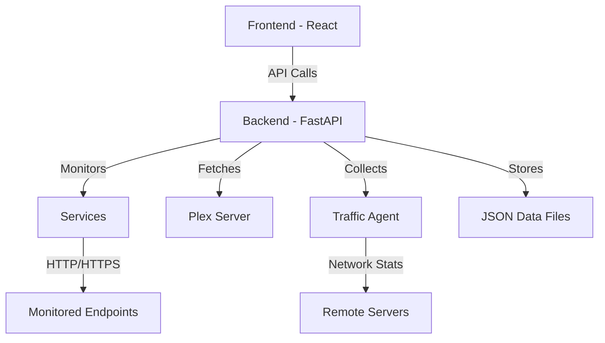

# Komandorr

<div align="center">
  
</div>

<p align="center"><strong>Modern Service Monitoring Dashboard</strong></p>

<p align="center">
  <a href="https://github.com/cyb3rgh05t/komandorr/releases"></a>
  <a href="https://hub.docker.com/r/cyb3rgh05t/komandorr"></a>
  <a href="https://github.com/cyb3rgh05t/komandorr/blob/main/LICENSE"></a>
</p>

---

## Overview

Komandorr is a modern, feature-rich service monitoring dashboard designed to keep track of your applications, websites, panels, and projects. With built-in Plex integration, traffic monitoring, and a beautiful multi-theme interface, Komandorr makes monitoring your infrastructure simple and elegant.

## Key Features

### Service Monitoring

- **Real-time Health Checks**: Monitor HTTP/HTTPS endpoints with customizable intervals
- **Service Groups**: Organize services into logical groups
- **Visual Status**: Color-coded service cards with instant status visibility
- **Service Types**: Support for websites, apps, panels, and servers

### VOD Streams (Plex Integration)

- **Real-time Activity Monitoring**: Track Plex downloads, streams, and transcodes
- **Progress Tracking**: Visual progress bars for active operations
- **Search & Filter**: Quickly find specific activities
- **Auto-refresh**: Live updates every 10 seconds

### Traffic Monitoring

- **Bandwidth Tracking**: Monitor upload/download speeds per service
- **Real-time Data**: Auto-refresh traffic statistics
- **Dashboard Integration**: Traffic data displayed directly on service cards
- **Remote Agent**: Monitor traffic from remote servers

### Themes & Customization

- **Multiple Themes**: Dark, Plex, Jellyfin, Emby, and more
- **Theme Switching**: Instant theme changes with smooth transitions
- **Custom Branding**: Komandorr orange accent color throughout

### Multi-Language Support

- **English & German**: Full bilingual support
- **Easy Switching**: Change language on-the-fly
- **Complete Translation**: All UI elements translated

### Security

- **Optional Authentication**: Basic HTTP authentication
- **Token-based**: Secure API access
- **Configurable**: Enable/disable as needed

## Quick Start

Get Komandorr up and running in minutes:

```bash
# Using Docker Compose
git clone https://github.com/cyb3rgh05t/komandorr.git
cd komandorr
docker-compose up -d
```

Visit `http://localhost:3000` and start monitoring!

[Installation Guide](getting-started/installation.md){ .md-button .md-button--primary }
[Configuration](getting-started/configuration.md){ .md-button }

## Architecture



## Technology Stack

### Frontend

- **React 18+**: Modern UI framework
- **React Router v6**: Client-side routing
- **Tailwind CSS**: Utility-first styling
- **react-i18next**: Internationalization
- **Lucide Icons**: Beautiful icon set

### Backend

- **FastAPI**: High-performance Python framework
- **Pydantic v2**: Data validation
- **httpx**: Async HTTP client
- **uvicorn**: ASGI server

## What's New in v1.4.0

- **VOD Streams**: Complete Plex integration for monitoring media server activities
- **Traffic Integration**: Dashboard service cards now display bandwidth data
- **Timezone Fixes**: Proper timezone configuration
- **API Documentation**: Custom dark-themed Swagger UI
- **Search**: Real-time search filtering for VOD activities

[View Full Changelog](changelog.md){ .md-button }

## Community & Support

- [Documentation](https://cyb3rgh05t.github.io/komandorr)
- [Issue Tracker](https://github.com/cyb3rgh05t/komandorr/issues)
- [Discussions](https://github.com/cyb3rgh05t/komandorr/discussions)

## License

Komandorr is released under the [MIT License](https://github.com/cyb3rgh05t/komandorr/blob/main/LICENSE).

---

<div align="center">
  Made with love by <a href="https://github.com/cyb3rgh05t">cyb3rgh05t</a>
</div>
